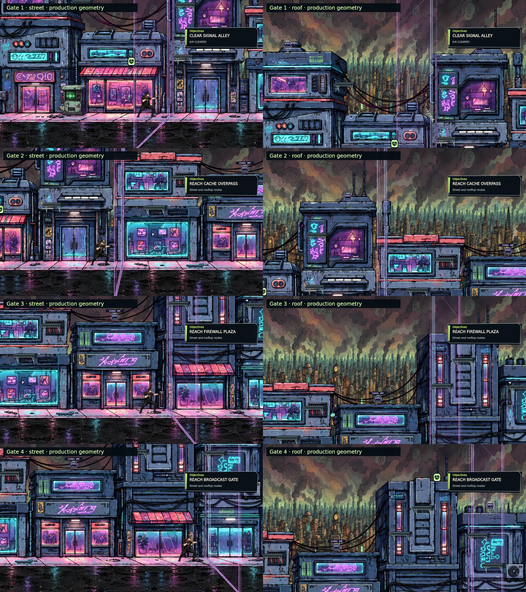
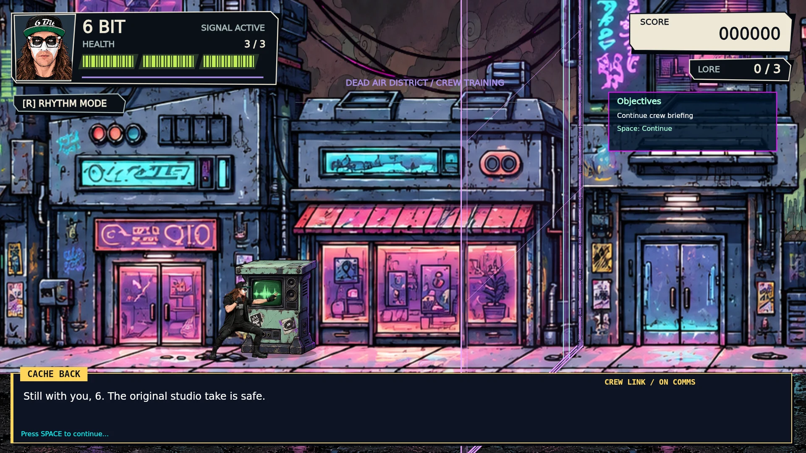

# Facade holograms and tutorial Objectives

The owner approved one PR after the September 16 conversation audit identified unfinished building alignment and an empty tutorial Objectives panel. Base/rollback: merged #67, `d3d6128ce63c795c4096a320012e2136e21dfbc4`. Branch: `agent/facade-hologram-objectives`.

The prior passes installed thinner emitter art and corrected draw order but kept the generic mount offset and leftward pavement slope at every gate. The first rail crossed the sign instead of following the building edge, and the right-hand gates did not follow their local pavement direction.

## Fitted geometry

Measurements use the existing `buildings.webp` at its production placement `(-152, -550)` and size `4400×1589`. Each facade has its own roof attachment, wall foot and curb point. One geometry function supplies the field, wall/ground modules, curb drop, asset bake bounds and collision alignment. The luminous thickness now fits the existing 14-unit rail instead of retaining a detached 58-unit slab.

| Gate | Wall mount x | Roof y | Wall foot y | Curb x | Blocking x, before → now |
| --- | ---: | ---: | ---: | ---: | --- |
| Signal Alley | 1382 | −197 | 824 | 1316 | 1320 → 1342 |
| Cache Overpass | 1980 | 49 | 824 | 1966 | 2110 → 1966 |
| Firewall Plaza | 3250 | −316 | 824 | 3302 | 3000 → 3269 |
| Broadcast Gate | 3830 | −88 | 824 | 3890 | 4010 → 3853 |

The first two tracks slope left and the last two slope right. All pass through the shared actor foot plane at y=856, traverse the y=888–892 curb and continue through y=1096 beyond the road edge. Moving the blocking line with the visible field avoids leaving an invisible obstacle at the old position. Each boundary still protects its same encounter, including during training and before its encounter starts. Trigger positions, packet/defeat quotas, instant unlock, 650 ms collapse, pressure reactions and enemy apertures remain.

Four powered/off WebP assemblies were rebaked from the existing thin rail kit using the production renderer. Their total encoded size falls from 157,228 to 111,368 bytes. The existing cache retains one image draw per visible static gate and two only during opening. No runtime canvas, filter, timer, decoder or animation owner was added. Immutable asset ancestor: `ac183cf0ccde1b716b82c5fdce9229d2de0c5032`. The source builder now consumes production bounds rather than maintaining another copy of the old geometry formula.

## Objectives transition

The tutorial previously drew its panel whenever the chapter had objectives, then filtered out completed tasks. Completing those tasks before advancing the remaining dialogue produced an empty panel. It now offers “Continue crew briefing” and the current Space or Create/View control. The actual next task replaces that cue when the chapter advances. A final automatic handoff does not request another press. Dialogue and gameplay input routing are unchanged.

## Preserved work and handoff

The recovered request audit found the recent implementations present. This pass keeps the permanent left terminal and its walking strip/depth, real animated background asset and heavier rain, original car motion/WATCH OUT/damage, central Jammer and edge guidance, Cross jump/beat and Down + Jump, hack keypad and untimed practice, contact handling, faint roof edges, drones, caches/repairs/cat, lift, boss art/upper pursuit/camera, music and win/loss/retry. The earlier audit is a record of the pre-repair state; it must not cause these completed implementations to be restarted.

The previous v70 source manifest, receipt and qualified owner feedback are retained in `verification/pr67-merged-history.json`. Exact final head, PR, local check results and CI outcomes belong to the generated source receipt. Visual Makko acceptance is pending; the draft remains unmerged.

## Evidence and reproduction

The existing native render tool produced street and rooftop views of every gate, plus a training view calling the real tutorial renderer after tasks complete. Its image/sprite loading and font boundary are adapted; these are not hosted Makko captures or an audio/controller/FPS acceptance claim.

```sh
FACADE_REVIEW=1 REVIEW_STILLS_ONLY=1 node tools/render-level1-rebuild.cjs /absolute/path/to/review-output
```





Existing production-module checks cover the changed gate renderer/collapse behavior, every fitted boundary at street and rooftop height, immediate cleared passage, baked registration, draw order, culling and the tutorial's task-to-dialogue cue for keyboard/controller. The older assertion requiring every gate to lean left was replaced with the authored facade geometry check; existing closed/open/collapse assertions remain. Static inventory changes are limited to shifted source locations. Required full suite and all-JavaScript syntax results are recorded against the final exported revision.

Use the newest route in `ACCEPTANCE.md`: inspect each full facade-to-road connection, push and cross active fields, clear all four encounters, then check the preserved Jammer/boss and environment systems. The authored blocking positions above are visible implementation choices to review in Makko, not a claim of owner playtest approval.
