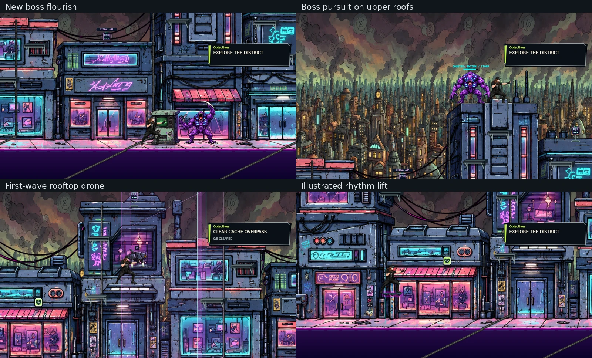
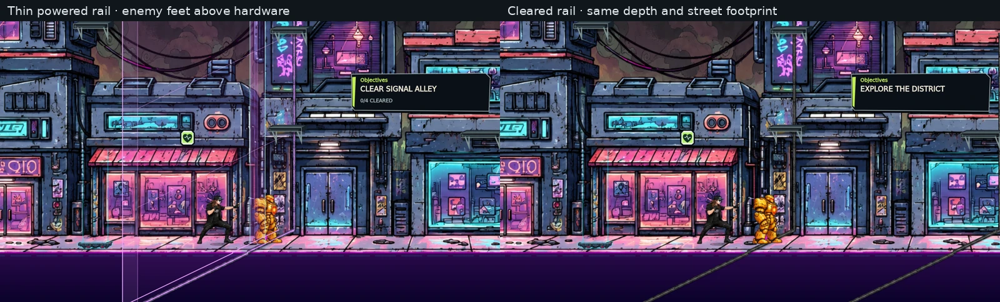

# Upper route and boss follow-up

## September 16, 2026 — upper routes, boss pursuit and readable guidance

Current review branch: `agent/upper-route-boss-polish`. Base/rollback: merged PR #59 (`a4c16069b008c508a1dca60aeba3aab7e3c29b3f`). This expands the saved Jammer-arrow repair with the owner's later request for visible drones, faint roof landing lines, free boss-combat camera movement, more rooftop exploration, a sharp boss flourish, an illustrated elevator and boss participation above the street. Earlier current-work entries are history.

The two existing mission drones move into the first packets over Cache's awning and Tower's lower roof. No extra mission kills: quota stays 20. Existing roof edges gain a one-screen-pixel light stroke with a faint dark keyline. Three optional crown-roof signal caches reward a total of 1,500 score and up to three existing Amp charges; rewards are one-time per run and checkpoint-consistent. The single broadcast terminal and existing platform geometry remain.

Boss combat releases the vertical camera lock. The boss takes a distance-aware route through actual supports using an 850 ms landing warning, an 800–1,250 ms animated leap, and a counter window after landing (one second plus the next beat on intermediate supports; normal recovery at the destination). No landing contact attack. Roof pulses stay on their support's height and horizontal span. Base health, damage, musical attack timings, and player movement remain. Retry returns the boss/camera to street state.

New illustrated lift carriage, twelve crisp whole-body flourish drawings and eight leap drawings are pinned to asset commit `b1e9de902b325a949562e8ebeece375a8452ecca`. The new flourish is drawn by the shared production image cache over the existing animation owner, avoiding the host's stale low-resolution artwork. The four-second entrance uses quick motion, a held roar and return; combat keeps its existing sweep clock. Boss idle/walk and all player art are preserved. Prompts and registration are in `assets/upper-route/`.

Read `UPPER_ROUTE_BOSS_PASS.md` and the latest acceptance route. Production-module and native-render evidence are not hosted Makko acceptance. Exact review revision, final test results and PR are in the generated receipt. Owner Makko review remains pending before merge.

## Focused review in Makko

Use the exact draft head in the source receipt, imported into a fresh preview.

1. Jammer: after the 20 defeats, leave it offscreen on either side. Walk and jump: the cue remains on that screen edge and disappears when the Jammer enters view. Repeat from an upper roof to check camera projection.
2. Drones: Cache Overpass's first packet has a drone above its awning; Broadcast Gate's first packet has one above the lower Tower roof. Climb toward them, check their warning/shot, stomp/rhythm defeat and H hijack. Both retain normal mission credit; all 20 kills still open the Jammer phase.
3. Route: use the two-beat rhythm lift. Verify the illustrated deck carries feet at its top. The faint roof lines identify landable surfaces. Explore the west crown (x300), cache crown (x1700) and broadcast crown (x3990). Touch each cache while standing on that roof; check one reward each, capped Amp charges and the third-cache bonus. The existing cat, lore, Amp and heart repairs remain.
4. Boss introduction: inspect blade edges/face at normal zoom and during the close-up. Verify the four-second gesture completes and control returns. This is newly drawn artwork, not another upscaled copy.
5. Boss fight: climb a roof. The camera follows you vertically. Watch the boss warn its landing and leap up through the real supports, with an opening after landing. Move back to street level and verify descent. Jump a roof pulse: it must not hit the street below or continue across a roof gap. The boss remains finishable by the established rhythm/stomp rules.
6. Check all four thin continuous emitter strips at street and roof height, including their cap, elbow and curb continuation. Watch enemies cross powered and cleared rails: feet stay above the hardware, and the field still parts locally.
7. Pause during a warning and flight; resume without a jump in position. Lose the fight and retry: player/boss and camera return to street, and cache/score/Amp state returns to the checkpoint without reward duplication. Check victory and full restart.

Record the imported SHA and PASS/FAIL. After acceptance/merge, read and import the actual main SHA and repeat this route. Rollback is the PR #59 base above.

## Verification and limits

`tools/check-upper-route.js` exercises production modules at 30/60/120 Hz: all five crown/high roof destinations and street return, bounded warned jumps, camera, pause, actual first-packet drone spawn/draw, cache one-time rewards, pulse height/span, retry state and all twelve flourish poses. Existing boss, traversal, original traffic, collision, intro and asset lifecycle suites remain required. `tools/render-level1-rebuild.cjs` has an opt-in upper-route native review using actual bundled art and the manifest-linked original boss walk. Its host image/sprite adapters do not emulate hosted audio/input performance.

The two earlier drones were late-wave guards on high crowns. The change makes them encounterable from the regular route; local evidence does not prove whether the owner's previous host had a separate stale-image delivery problem. All new images use immutable URLs and the existing bundled fallback. No new canvas, event loop, timer, package or gameplay loading owner is introduced.

The continuation also narrows the existing continuous emitter artwork to 14 world units, with compact caps and elbows, retaining its full facade-to-street footprint and prebaked powered/off states. Only emitter hardware draws behind enemies; gate fields, lift, repairs, props and boss retain the established foreground order. Original cars and the single broadcast terminal remain. Faint platform edges are distinct from the barrier hardware.

## Native review reproduction

Fetch the unchanged `sector_1_boss_walk_walk.webp` and `.json` from their current `sprites-manifest.json` URLs into a local cache directory, then run:

```sh
UPPER_ROUTE_REVIEW=1 BOSS_WALK_CACHE=/absolute/path/to/walk-cache REVIEW_STILLS_ONLY=1 node tools/render-level1-rebuild.cjs /absolute/path/to/review-output
```

The existing runtime bundle supplies native Canvas for this optional render; production and dependency-free validation require no new package. The resulting 22-second clip stages the player to inspect camera/pursuit and does not claim a recorded human Makko playthrough.

## Local review evidence

The final local `npm test`, `npm run check:syntax:all`, and native 22-second review completed successfully. The static inventory changes only by adding the new test file; no earlier assertions or mechanics were removed to obtain a pass. GitHub CI and exact head belong to the generated receipt.



[Native production-module motion clip](verification/upper-route-boss-review.mp4). Host image/sprite boundaries are adapted, and player placements are scripted. This is not a Makko acceptance capture.

Slim rail asset pin: `c0b459ed219af816f696116ad3e37f64fad20460`. All four rail sheets and all three lift/boss sheets were downloaded from their immutable runtime URLs and matched the local SHA-256 hashes.


